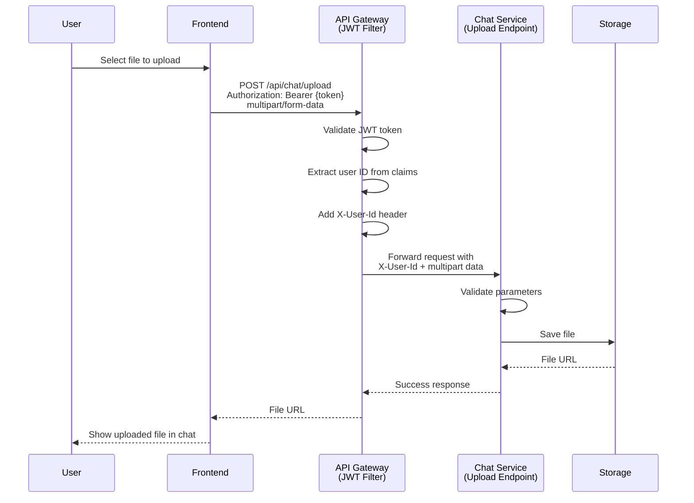

# Design Document: Chat File Upload Fix

## Overview

This design addresses the 400 Bad Request errors occurring when users attempt to upload files through the chat interface. The issue stems from the API Gateway's JWT authentication filter not properly forwarding the `X-User-Id` header for multipart/form-data requests. The solution involves ensuring the JWT filter correctly processes and forwards authentication headers for all request types, including file uploads.

The fix will be implemented across three layers:
1. **API Gateway**: Ensure JWT filter properly handles multipart requests
2. **Backend Controller**: Add better error handling and logging
3. **Frontend**: Improve error feedback to users

## Architecture

### Current Flow (Broken)

```
User uploads file → Frontend sends multipart request with JWT
  ↓
API Gateway JWT Filter validates JWT
  ↓
Gateway extracts user ID from JWT
  ↓
[ISSUE] X-User-Id header not forwarded for multipart requests
  ↓
Backend receives request without X-User-Id header
  ↓
400 Bad Request error
```

### Fixed Flow

```
User uploads file → Frontend sends multipart request with JWT
  ↓
API Gateway JWT Filter validates JWT
  ↓
Gateway extracts user ID from JWT and adds X-User-Id header
  ↓
Gateway forwards request with all headers preserved
  ↓
Backend receives request with X-User-Id header
  ↓
File processed successfully
```

### Component Interaction



## Components and Interfaces

### 1. JWT Authentication Filter (JwtAuthFilter.java)

**Current Implementation Issue:**
The filter correctly extracts user ID from JWT and adds the `X-User-Id` header, but Spring Cloud Gateway's reactive nature may cause issues with multipart request body consumption.

**Solution:**
The current implementation should work correctly. The issue is likely that the request body is being consumed during filtering, preventing it from being forwarded. We need to ensure the filter doesn't consume the request body.

**Key Changes:**
- Verify the filter doesn't read the request body
- Ensure header mutation happens before body processing
- Add logging to track header forwarding

**Interface:**
```java
public class JwtAuthFilter implements GlobalFilter, Ordered {
    @Override
    public Mono<Void> filter(ServerWebExchange exchange, GatewayFilterChain chain) {
        // Extract JWT claims
        // Add X-User-Id header to mutated request
        // Forward without consuming body
    }
}
```

### 2. Chat Controller Upload Endpoint (ChatController.java)

**Current Implementation:**
```java
@PostMapping("/upload")
public ResponseEntity<Map<String, Object>> uploadFile(
    @RequestHeader("X-User-Id") String userId,
    @RequestParam("file") MultipartFile file,
    @RequestParam("conversationId") String conversationId,
    @RequestParam("type") String type)
```

**Enhancements Needed:**
- Add detailed logging for debugging
- Improve error messages
- Add request validation logging

**Interface remains the same** but with enhanced error handling.

### 3. Frontend Upload Handler (ChatPage.tsx)

**Current Implementation:**
```typescript
const handleFileUpload = async (file: File, type: 'IMAGE' | 'FILE') => {
  const formData = new FormData();
  formData.append('file', file);
  formData.append('conversationId', selectedConvo);
  formData.append('type', type);
  
  const response = await fetch(`${API_URL}/api/chat/upload`, {
    method: 'POST',
    headers: {
      'Authorization': `Bearer ${token}`,
    },
    body: formData,
  });
}
```

**Enhancements Needed:**
- Better error handling with specific error messages
- Retry logic for transient failures
- Progress indication for large files

## Data Models

### Upload Request (Multipart Form Data)

```
Content-Type: multipart/form-data; boundary=----WebKitFormBoundary...

------WebKitFormBoundary...
Content-Disposition: form-data; name="file"; filename="image.jpg"
Content-Type: image/jpeg

[binary file data]
------WebKitFormBoundary...
Content-Disposition: form-data; name="conversationId"

conv-123-456
------WebKitFormBoundary...
Content-Disposition: form-data; name="type"

IMAGE
------WebKitFormBoundary...--
```

### Upload Response

```json
{
  "success": true,
  "url": "/uploads/chat/user123/conv456/file789.jpg",
  "message": "Fichier uploadé avec succès"
}
```

### Error Response

```json
{
  "success": false,
  "message": "Missing required header: X-User-Id"
}
```

## Correctness Properties

*A property is a characteristic or behavior that should hold true across all valid executions of a system—essentially, a formal statement about what the system should do. Properties serve as the bridge between human-readable specifications and machine-verifiable correctness guarantees.*


### Property 1: JWT Filter Header Forwarding for All Authenticated Requests

*For any* authenticated request with a valid JWT token, when processed by the JWT filter, the forwarded request should contain both the original Authorization header and the X-User-Id header extracted from the JWT claims.

**Validates: Requirements 1.1, 1.2, 1.3, 1.4**

### Property 2: Frontend Upload Request Structure

*For any* file upload (image, document, or audio), the frontend should send a multipart/form-data request containing the file, conversationId, and type parameters along with the Authorization header.

**Validates: Requirements 2.1, 2.2, 2.3, 2.4**

### Property 3: Successful Upload Processing

*For any* valid upload request with all required parameters (X-User-Id header, file, conversationId, and valid type), the upload endpoint should successfully process the file and return a response containing the file URL.

**Validates: Requirements 2.5**

### Property 4: Invalid Type Rejection

*For any* upload request with an invalid type value (not IMAGE, FILE, or AUDIO), the upload endpoint should return a 400 Bad Request response with a descriptive error message.

**Validates: Requirements 3.5**

### Property 5: Upload Success UI Feedback

*For any* successful file upload, the frontend should display a success notification and render the uploaded content in the chat interface.

**Validates: Requirements 4.4**

### Property 6: Upload Progress Indication

*For any* file upload in progress, the frontend should display a loading indicator until the upload completes or fails.

**Validates: Requirements 4.5**

### Property 7: Content-Type Header Preservation

*For any* multipart/form-data upload request routed through the API Gateway, the Content-Type header should be preserved and forwarded to the backend service without modification.

**Validates: Requirements 5.2**

### Property 8: Gateway Parameter Transparency

*For any* upload request, the parameters received by the upload endpoint when accessed through the API Gateway should be identical to the parameters received when accessed directly.

**Validates: Requirements 5.3, 5.4**

## Error Handling

### Gateway Level Errors

1. **Invalid JWT Token**
   - Status: 401 Unauthorized
   - Response: Empty (handled by gateway)
   - Frontend Action: Redirect to login

2. **Missing Authorization Header**
   - Status: 401 Unauthorized
   - Response: Empty (handled by gateway)
   - Frontend Action: Redirect to login

### Backend Level Errors

1. **Missing X-User-Id Header**
   - Status: 400 Bad Request
   - Response: `{"success": false, "message": "Missing required header: X-User-Id"}`
   - Frontend Action: Display error "Authentication failed. Please try again."
   - Logging: ERROR level with request details

2. **Missing File Parameter**
   - Status: 400 Bad Request
   - Response: `{"success": false, "message": "Missing required parameter: file"}`
   - Frontend Action: Display error "No file selected. Please try again."
   - Logging: WARN level

3. **Missing ConversationId Parameter**
   - Status: 400 Bad Request
   - Response: `{"success": false, "message": "Missing required parameter: conversationId"}`
   - Frontend Action: Display error "Invalid request. Please refresh and try again."
   - Logging: WARN level

4. **Missing Type Parameter**
   - Status: 400 Bad Request
   - Response: `{"success": false, "message": "Missing required parameter: type"}`
   - Frontend Action: Display error "Invalid request. Please try again."
   - Logging: WARN level

5. **Invalid Type Value**
   - Status: 400 Bad Request
   - Response: `{"success": false, "message": "Invalid type value. Must be IMAGE, FILE, or AUDIO"}`
   - Frontend Action: Display error "Invalid file type. Please try again."
   - Logging: WARN level

6. **File Storage Error**
   - Status: 500 Internal Server Error
   - Response: `{"success": false, "message": "Failed to store file"}`
   - Frontend Action: Display error "Server error. Please try again later."
   - Logging: ERROR level with stack trace

### Frontend Error Handling Strategy

```typescript
try {
  const response = await fetch(uploadUrl, options);
  
  if (!response.ok) {
    if (response.status === 401) {
      // Authentication error
      toast.error("Authentication failed. Please log in again.");
      navigate('/login');
    } else if (response.status === 400) {
      // Validation error
      const error = await response.json();
      toast.error(error.message || "Invalid request. Please try again.");
    } else if (response.status >= 500) {
      // Server error
      toast.error("Server error. Please try again later.");
    } else {
      // Other errors
      toast.error("Upload failed. Please try again.");
    }
    return;
  }
  
  const result = await response.json();
  // Handle success
} catch (error) {
  // Network error
  toast.error("Network error. Please check your connection.");
}
```

## Testing Strategy

### Unit Tests

Unit tests will focus on specific examples, edge cases, and error conditions:

1. **JWT Filter Tests**
   - Example: Valid JWT with user ID "user123" produces X-User-Id header with "user123"
   - Example: Request without Authorization header returns 401
   - Example: Request with invalid JWT returns 401

2. **Upload Endpoint Tests**
   - Example: Request without X-User-Id header returns 400 with specific error message
   - Example: Request without file parameter returns 400 with specific error message
   - Example: Request without conversationId returns 400 with specific error message
   - Example: Request without type parameter returns 400 with specific error message
   - Example: Request with type "INVALID" returns 400 with specific error message
   - Example: Valid request with all parameters returns 200 with file URL

3. **Frontend Upload Handler Tests**
   - Example: Image file selection triggers upload with type "IMAGE"
   - Example: Document file selection triggers upload with type "FILE"
   - Example: Audio recording triggers upload with type "AUDIO"
   - Example: 401 response shows authentication error and redirects to login
   - Example: 400 response shows validation error message
   - Example: 500 response shows server error message
   - Example: Network error shows connection error message

### Property-Based Tests

Property-based tests will verify universal properties across all inputs. Each test should run a minimum of 100 iterations.

1. **Property Test: JWT Filter Header Forwarding**
   - **Feature: chat-file-upload-fix, Property 1**: JWT Filter forwards both Authorization and X-User-Id headers
   - Generate: Random valid JWT tokens with different user IDs
   - Verify: Forwarded request contains both headers with correct values
   - Library: JUnit + QuickTheories (Java)

2. **Property Test: Frontend Upload Request Structure**
   - **Feature: chat-file-upload-fix, Property 2**: Frontend sends complete multipart requests
   - Generate: Random files (images, documents, audio) with random conversation IDs
   - Verify: Request contains file, conversationId, type, and Authorization header
   - Library: Jest + fast-check (TypeScript)

3. **Property Test: Successful Upload Processing**
   - **Feature: chat-file-upload-fix, Property 3**: Valid requests are processed successfully
   - Generate: Random valid upload requests with all required parameters
   - Verify: Response is 200 with file URL
   - Library: JUnit + QuickTheories (Java)

4. **Property Test: Invalid Type Rejection**
   - **Feature: chat-file-upload-fix, Property 4**: Invalid types are rejected
   - Generate: Random strings that are not "IMAGE", "FILE", or "AUDIO"
   - Verify: Response is 400 with error message
   - Library: JUnit + QuickTheories (Java)

5. **Property Test: Upload Success UI Feedback**
   - **Feature: chat-file-upload-fix, Property 5**: Success shows notification and content
   - Generate: Random successful upload responses
   - Verify: Success toast is displayed and content appears in chat
   - Library: Jest + fast-check + React Testing Library (TypeScript)

6. **Property Test: Upload Progress Indication**
   - **Feature: chat-file-upload-fix, Property 6**: Loading indicator shown during upload
   - Generate: Random upload operations
   - Verify: Loading indicator is visible while upload is in progress
   - Library: Jest + fast-check + React Testing Library (TypeScript)

7. **Property Test: Content-Type Header Preservation**
   - **Feature: chat-file-upload-fix, Property 7**: Content-Type header is preserved
   - Generate: Random multipart requests with various Content-Type boundaries
   - Verify: Backend receives identical Content-Type header
   - Library: JUnit + QuickTheories (Java)

8. **Property Test: Gateway Parameter Transparency**
   - **Feature: chat-file-upload-fix, Property 8**: Gateway forwards all parameters
   - Generate: Random form data with multiple parameters
   - Verify: Backend receives all parameters with correct values
   - Library: JUnit + QuickTheories (Java)

### Integration Tests

Integration tests will verify the complete flow from frontend to backend:

1. **End-to-End Upload Flow**
   - Start gateway and chat service
   - Send upload request from simulated frontend
   - Verify file is stored and URL is returned
   - Verify file can be retrieved from returned URL

2. **Authentication Flow**
   - Send upload request with valid JWT
   - Verify X-User-Id header is added by gateway
   - Verify backend receives and processes request

3. **Error Flow**
   - Send upload request without JWT
   - Verify 401 response from gateway
   - Send upload request with invalid parameters
   - Verify 400 response from backend

### Testing Libraries

- **Java (Backend & Gateway)**: JUnit 5, Mockito, Spring Boot Test, QuickTheories
- **TypeScript (Frontend)**: Jest, React Testing Library, fast-check, MSW (Mock Service Worker)

### Test Coverage Goals

- Unit test coverage: 80% minimum
- Property test coverage: All correctness properties implemented
- Integration test coverage: All critical paths (happy path + error paths)
